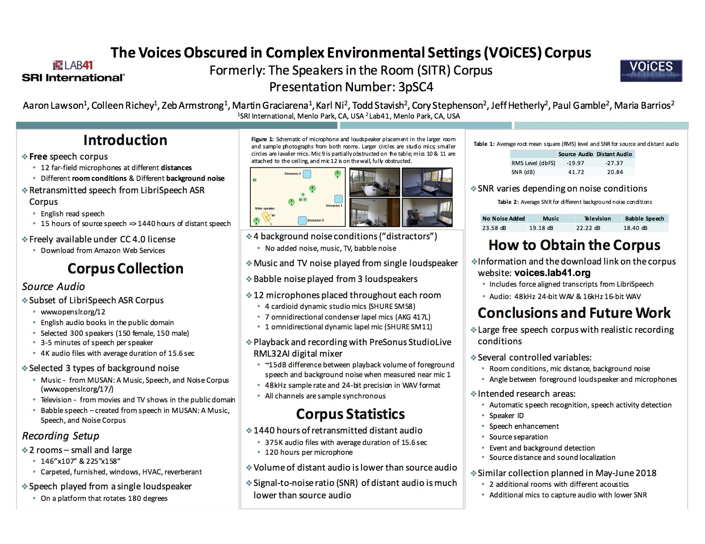

Lab41 and SRI International will be attending the [Acoustical Society of America](http://acousticalsociety.org/) at 2018, May 7-11. We will be presenting our work in presentation. Details about our corpus will be provided. We will also be handing out VOiCES flyers and talking with prospectives as well as promoting the corpus. Come visit our poster.

**Abstract**: 
Voices Obscured in Complex Environmental Setting (VOiCES) corpus is a collaboration between Lab41 and SRI International, designed to be a freely available data set for speech and acoustics research in noisy room conditions.  The main focus of the corpus is on distant microphone collection in a series of four rooms of different sizes and configurations. There are both foreground speech and background adversarial sounds, played through high-quality speakers in each room to create multiple, realistic acoustic environments. The foreground speech is played from a randomly rotating speaker to emulate head motion.  Foreground speech consists of approximately 15 hours of audio from LibriVox audio collections per session per microphone and the background distractor sounds will consist of babble, music, HVAC, TV/radio, dogs, vehicles and weather sounds drawn from the MUSAN collection. Each room has multiple sessions to exhaustively cover the background foreground combinations, and the audio is collected with twelve different microphones (omnidirectional lavalier, studio cardioid and piezoelectric) placed strategically around the room. The resulting data set was designed to enable acoustic research on event detection, background detection, source separation, speech enhancement, source distance, sound localization, as well as speech research on speaker recognition, speech activity detection, speech recognition and language recognition.

The [Acoustical Society of America Meeting](http://acousticalsociety.org/) was held from May 7-11, 2018 in Minneapolis, Minnesota.

